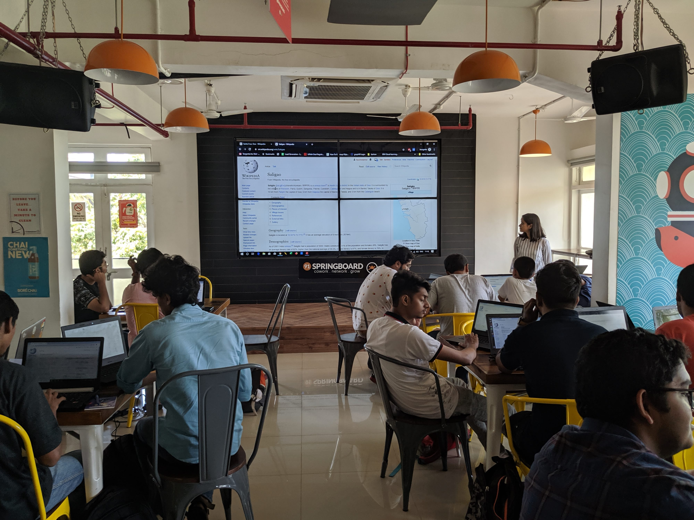
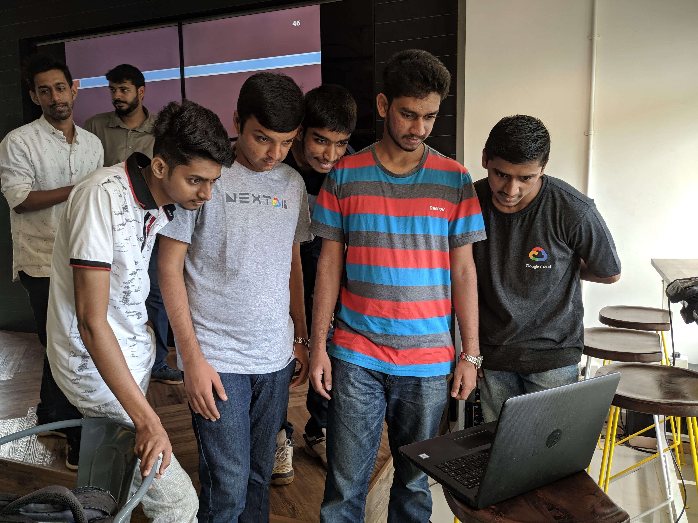
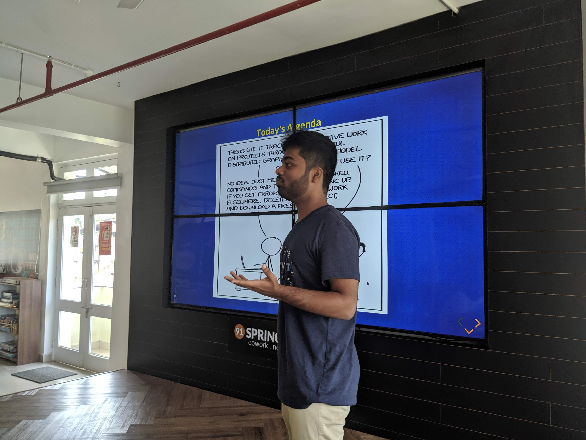
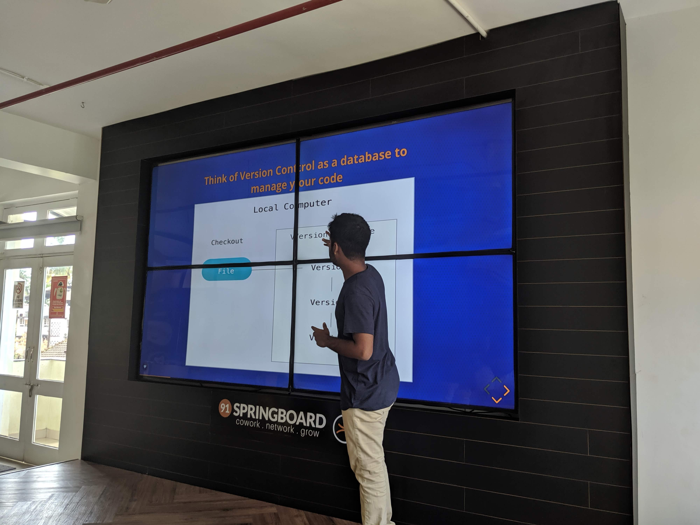
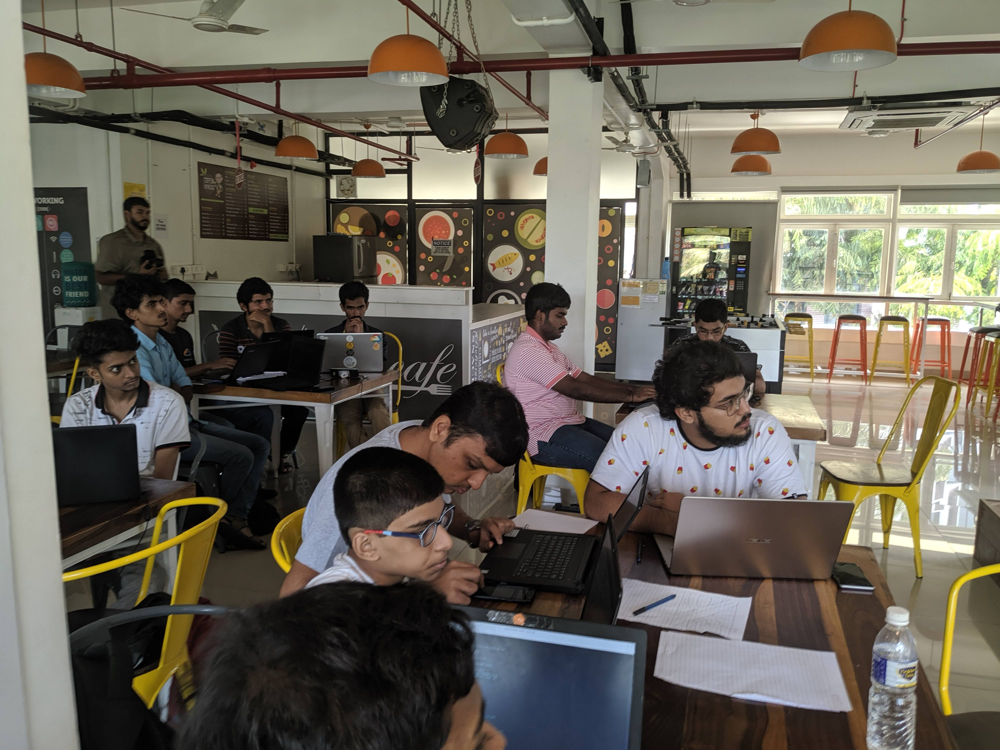

### FCGEC and Dev Cluster organised a workshop on Hacktoberfest at 91Springboard

- The event began with speakers from Dev Cluster - Nikhil, Tanmay and Vardhana talking about Wikimedia and Creative Commons.
  Nikhil came up with a fun group activity to facilitate team communication.
  They later explained how one can contribute to wikipedia.

- Next, Saheel Wagh from FCGEC explained briefly about git and it's importance. He and I (Vipul), then helped the audience set up and configure git on their laptops. He continued leading the audience to create a Pull Request to a repository.

- Lastly, I explained the benefits of contributing to open source and the importance of open source software.

