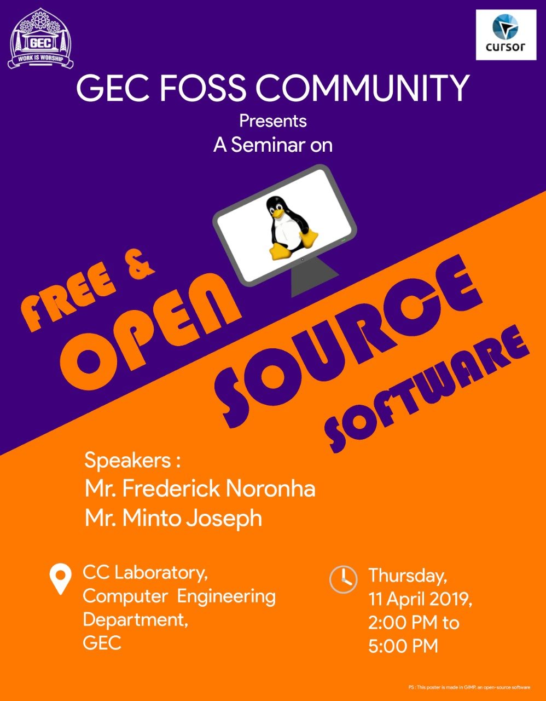
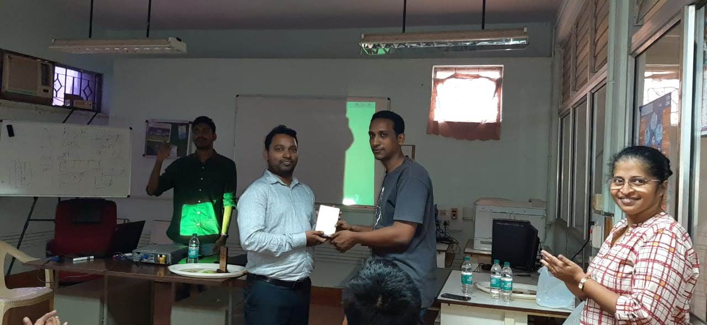
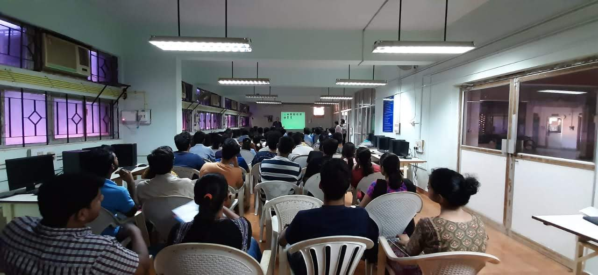

### The GEC FOSS club organised it's inaugral event on 11th April, 2019.

The inauguration featured talks by two veterans of the Goa FSUG - _Mr. Minto Joseph_ and _Mr. Frederick Noronha_. The event began on schedule, at 2pm in the CC Lab (Computer department).

- Mr. Minto was the first speaker, and talked about the Open Source movement, the ideology behind it and shared some of the work he's done for it.

- Next, Mr. Frederick shared with us his journey with the Linux Foundation and FOSS Communities, both in Goa and worldwide. Both talks along with an installation ceremony for the club council concluded by 4pm.

