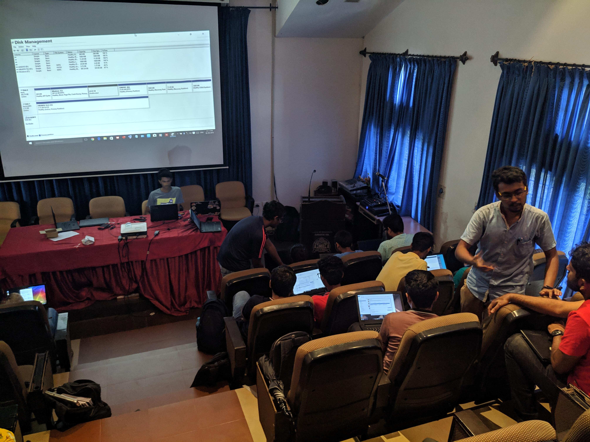
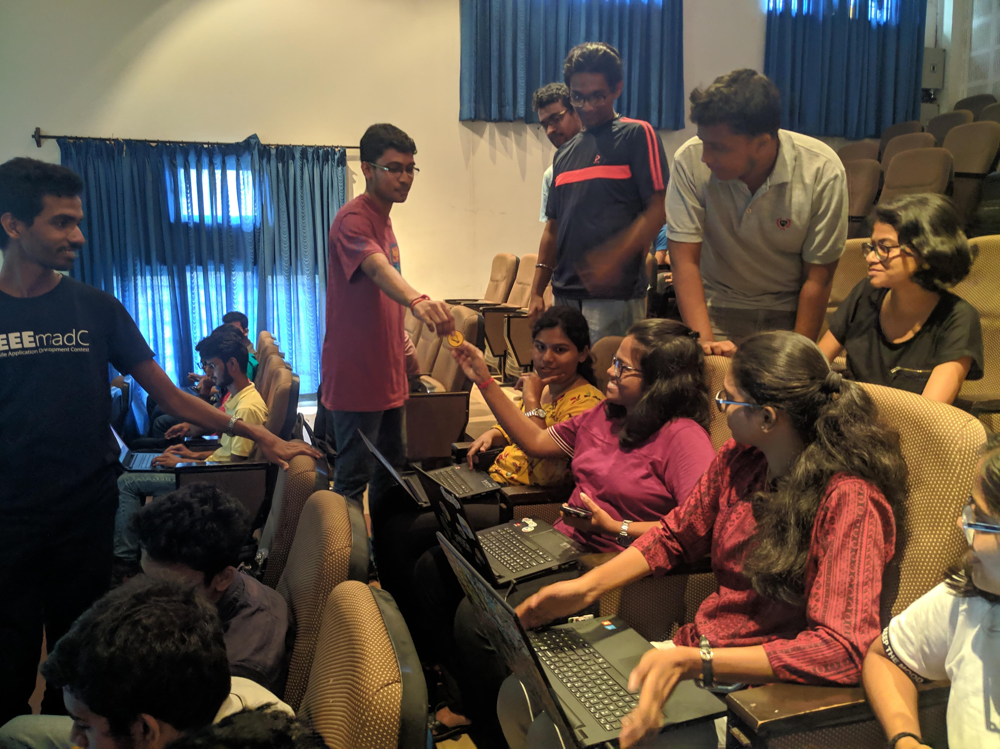

The event began at 2:30pm in the IT Department auditorium and was led by Julius Alphonso.
The event was attended by 24 people and 11 volunteers.

It began with instructions on how to make a LiveUSB using rufus, then the attendants were shown how to shrink their windows partition size to make space for a linux partition.

Following this the attendants were shown how to boot into the LiveUSB and install linux on their systems.

The participants were given ‘Tux’ stickers after successfully booting into Linux.
A short demonstration on basic terminal commands was held.

The event was concluded by 4:45PM. The event was conducted smoothly and any difficulties were quickly sorted out thanks to the volunteers.

