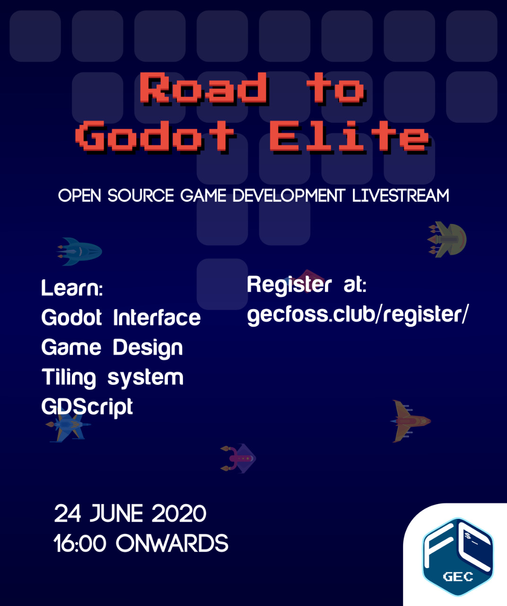

 

### GEC FOSS Community presents Road to Godot Elite

 

Be it massive AAA games like COD, Far Cry or arcade classics like pacman, many have wondered about what goes on towards making such a product. Well here we are to turn that spark into a flame. Our very own Julius Alphonso will take you on a tour of Godot engine.

 

We'll be covering concepts involved in game development, use of the FOSS game engine - Godot, entity movements and much more. We will be creating a demo game of pong during the session.

 

All you need to do to follow along is download Godot.

 

Best part? It's FREE and Open to all.

 

Requirements:
 

- [Godot Download Link](https://godotengine.org/download)
   
- [Resource Pack Download Link](https://docs.godotengine.org/en/2.1/_downloads/pong_assets.zip)

 
Good luck, have fun!
 

### **[Register Now!!](/register)**

 
