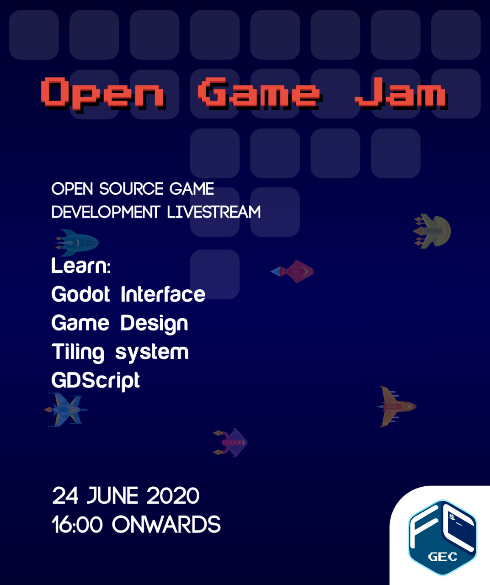

 

### GEC FOSS Community presents Road to Godot Elite

 

Be it massive AAA games like COD or Far Cry, gorgeous indies like Celeste, arcade classics like Pacman or many of the wallet defeulers so abundant on the playstore - we've all enjoyed a good video game. They provide immersive and interactive narrative experiences like no other medium.

 

Many have wondered about what goes into making such a product. Well here we are to turn that spark into a flame. Our very own Julius Alphonso will take you on a tour of the Godot engine. Teaching just how everything in a game is made as he live streams the development of an arcade classic - Pacman.

 

We'll be covering concepts involved in game development, use of the FOSS game engine - Godot, entity movements, scoring systems and even the AI used by the ghosts.

All you need is Godot, familiarity with vector maths, and some media resources.

 

Best part? It's FREE and Open to all.

Download Godot at : https://godotengine.org/download

Resource pack :

Good luck, have fun!

 

### **[Register Now !!](/register)**

 
